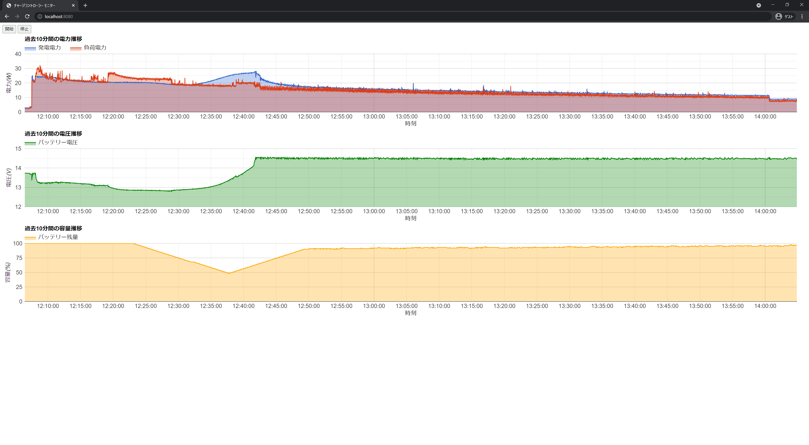

# solar-monitor

チャージコントローラーから 1 秒毎にデータを取得してグラフ化するプログラムです。  
(This program is get power-data from charge controller every second, and graphed)

 
 




[](https://www.youtube.com/watch?v=efbGyuWX_BE)

[](https://www.youtube.com/watch?v=VzXYcjmUyp4)

## 必要要件 (Requirement)

- PV コントローラー (PV controller)
  - Epever 製の Tracer AN/BN/CN シリーズ, LS-B シリーズ  
    (Epever Tracer AN/BN/CN Series, LS-B Series)
- Java 11 以降 (Java 11 or higher)
- Maven

## 使い方 (Usage)

1. PC と PV コントローラーを RS485 USB アダプターで接続してください。  
   (Connect PC and PV controller with RS485 USB Adapter)

2. application.yml を編集して、PV コントローラーの接続情報を記入してください。  
   (Edit application.yml and fills connect information of PV Controller)

3. 実行 (Execute)

   - VS Code 上で実行 (Run on VS Code)  
     App.java を右クリックして実行してください。 (Right-click on the App.java and run)

   - ターミナル上で実行 (Run on terminal)
     ```command
     mvn clean package
     java -jar solar-monitor-1.0.jar
     ```

4. ブラウザに画面を表示 (Display in browser)

   ```url
   http://localhost:8080
   ```

5. 測定開始 (Start measurement)  
   "実行"ボタンを押してください。(Press "実行" Button)
